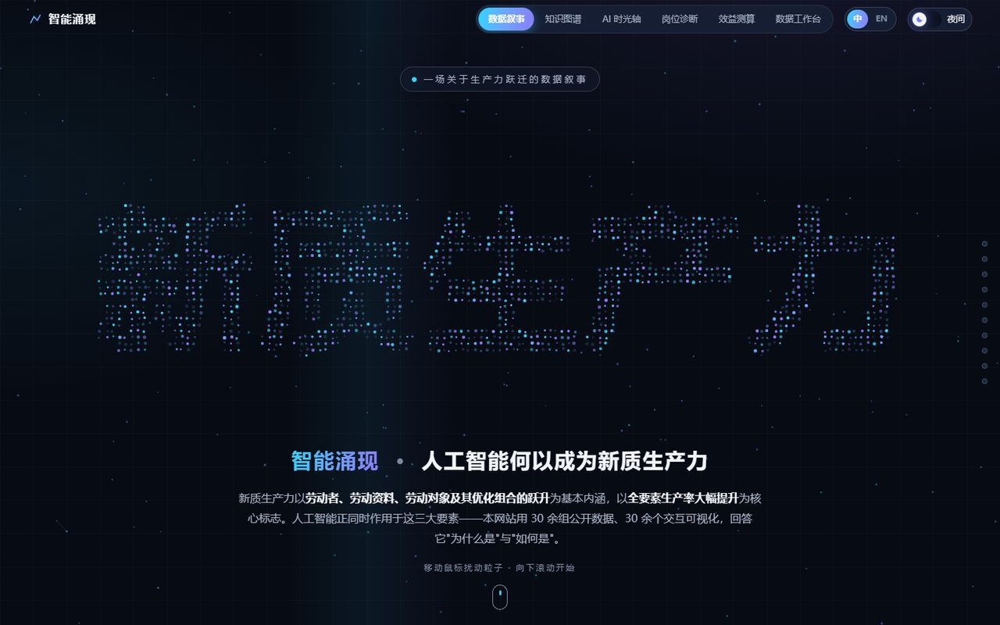
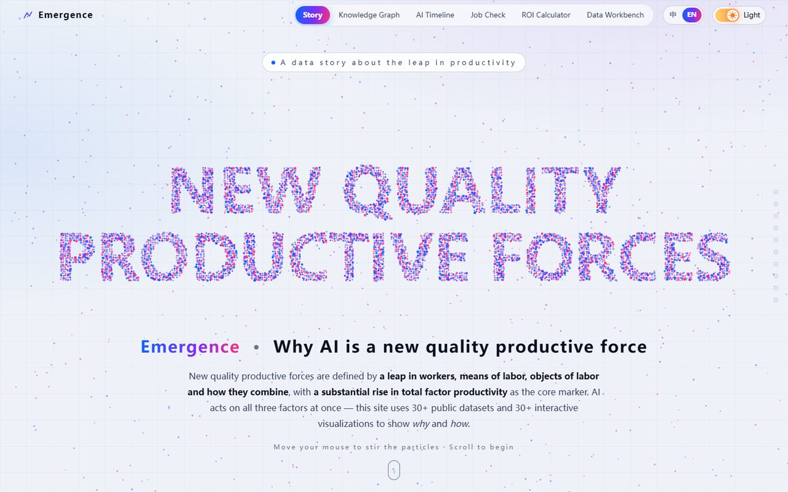
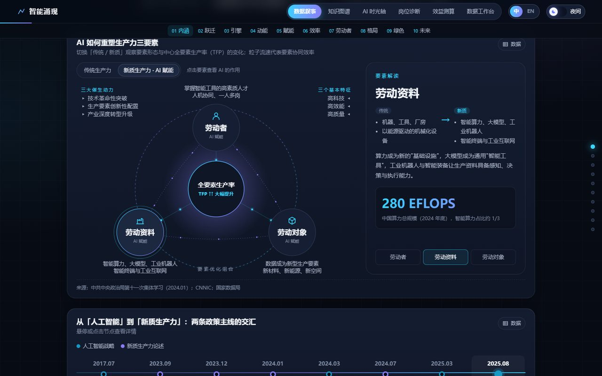
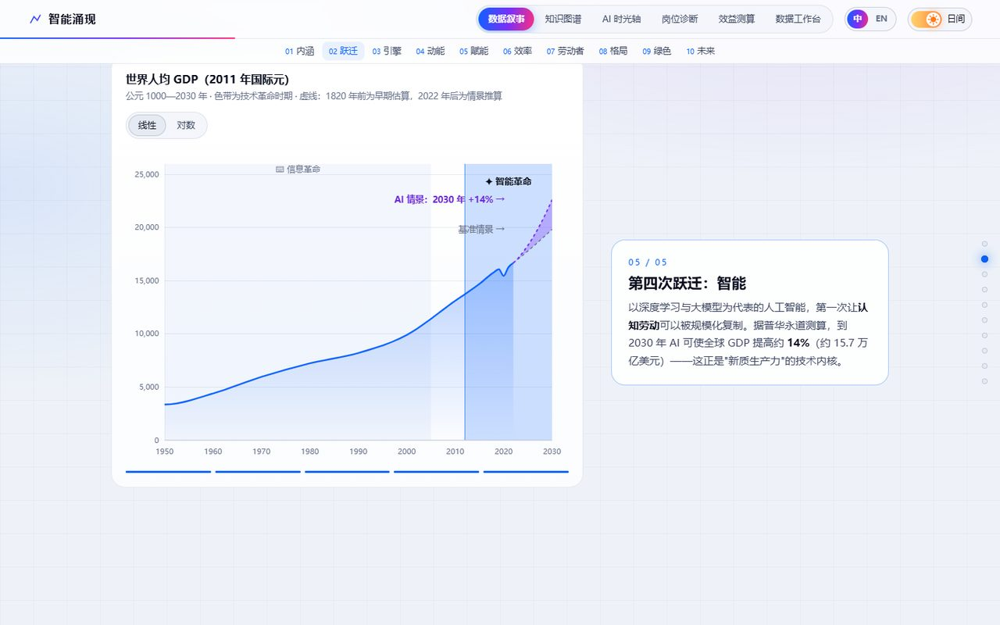
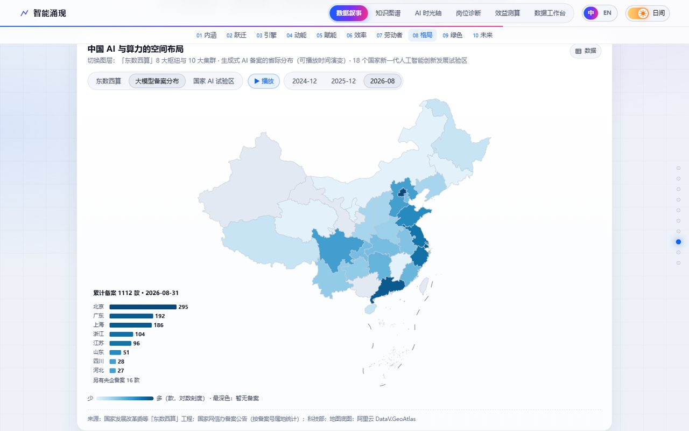
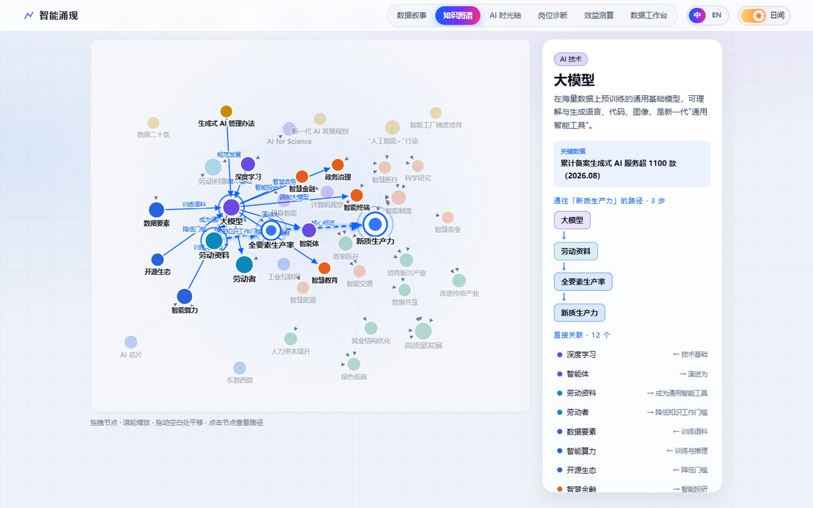
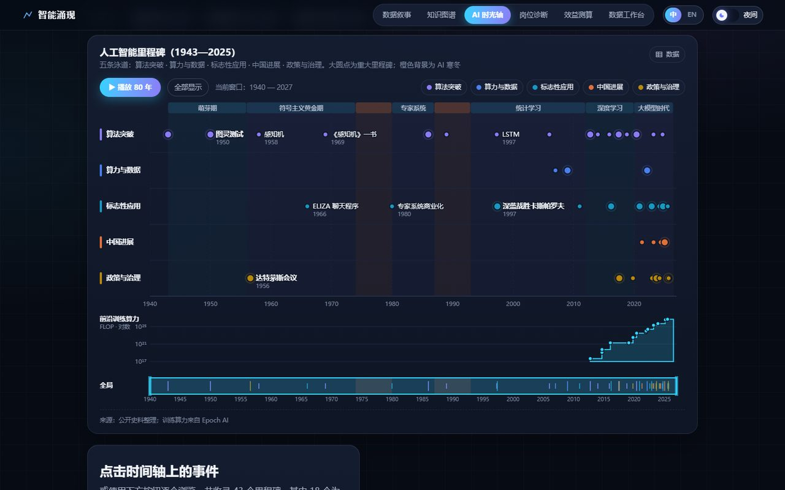
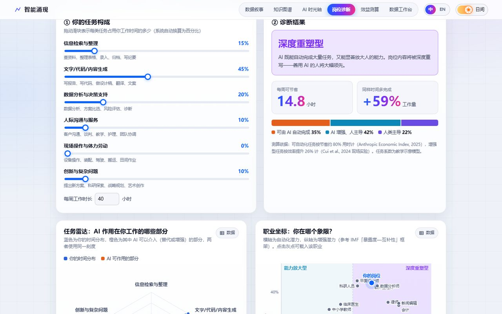
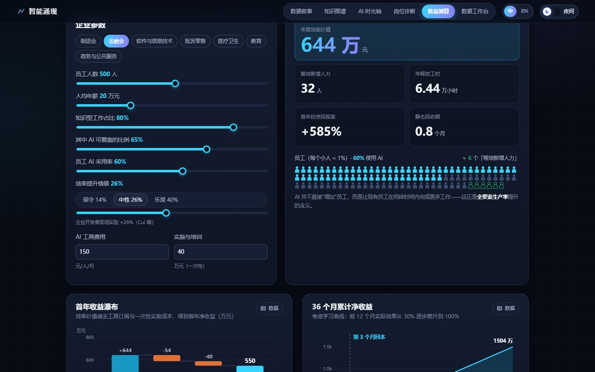

<div align="center">

# AI-for-NQP · 智能涌现

**用数据可视化讲述：人工智能作为新质生产力的作用和意义**<br>
*AI Drives the Development of New Quality Productive Forces — a data-visualization story*

[](https://svelte.dev)
[](https://vite.dev)
[](https://d3js.org)
[](https://p5js.org)


**[中文](#中文) · [English](#english)**




</div>

---

## 截图预览 · Screenshots

| 三要素关系图 · Three factors | 千年生产力曲线 · 1,000-year curve | 中国 AI 空间格局 · China map |
|:---:|:---:|:---:|
|  |  |  |
| **知识图谱 · Knowledge graph** | **AI 时光轴 · AI timeline** | **岗位诊断 · Job check** |
|  |  |  |
| **效益测算 · ROI calculator** | | |
|  | | |

---

## 中文

### 目录

1. [项目简介](#1-项目简介)
2. [功能亮点](#2-功能亮点)
3. [快速开始](#3-快速开始)
4. [页面与路由](#4-页面与路由)
5. [数据叙事：十个章节](#5-数据叙事十个章节)
6. [五个交互工具](#6-五个交互工具)
7. [技术栈](#7-技术栈)
8. [目录结构](#8-目录结构)
9. [主题与多语言](#9-主题与多语言)
10. [数据来源与口径](#10-数据来源与口径)
11. [部署](#11-部署)
12. [项目文档](#12-项目文档)
13. [说明](#13-说明)

### 1. 项目简介

**智能涌现**是一个纯前端的数据可视化网站，主题是「人工智能作为新质生产力的作用和意义」。

全站以新质生产力的官方定义为主线展开论证：

> 新质生产力 = **劳动者、劳动资料、劳动对象**及其优化组合的跃升，以**全要素生产率大幅提升**为核心标志。

论证分为四步：

1. AI 同时作用于三大要素，是一种「通用目的技术」。
2. 技术革命性突破、生产要素创新性配置、产业深度转型升级这三大催生动力，在 AI 身上都有量化证据。
3. 微观上，随机对照实验证明 AI 能提升效率；宏观上，AI 正在重塑就业结构与空间格局。
4. 最终落点是全要素生产率跃升与高质量发展。

| 规模 | 数量 |
|---|---|
| 页面 | 1 条滚动叙事 + 5 个交互工具页 |
| 叙事章节 | 10 章 + 首屏 + 结语 |
| 可视化组件 | 30 个（`src/lib/charts/`） |
| 数据集 | 23 组，参考文献 26 项 |
| 主题 / 语言 | 日间 · 夜间 / 中文 · English |

### 2. 功能亮点

- **会讲故事的图**：千年人均 GDP 曲线随滚动缩放，依次聚焦蒸汽、电气、信息、智能四次技术革命。
- **可以动手的图**：
  - 生产函数模拟器：拖动参数，观察 AI 如何改变增长轨迹。
  - 岗位诊断：拆解个人工作中哪些部分会被 AI 替代、增强或仍由人主导。
  - 效益测算：估算企业引入 AI 的投资回报与回收期。
- **会推理的图**：知识图谱用 BFS 最短路径算法，点亮任意概念通往「新质生产力」的因果链，例如 大模型 → 劳动资料 → 全要素生产率 → 新质生产力。
- **有情绪的图**：
  - 首屏：p5.js 粒子从无序汇聚成「新质生产力」，鼠标靠近时会被扰动。
  - 结语：一张不断生长的智能网络。
- **数据可信**：
  - 每张图都标注来源，并可一键切换为数据表视图。
  - 存在统计口径差异的地方如实标注；示意模型明确标为示意。
- **双主题 + 双语**：
  - 日夜主题切换时，以点击位置为圆心做圆形扩散动画。
  - 中英文全局切换，数值单位也会换算成对应语言的习惯。
- **色彩科学**：两套主题的图表色板都经过色觉障碍（CVD）模拟校验，相邻颜色在红 / 绿色盲视角下仍可区分。

### 3. 快速开始

**环境要求**：Node.js `^20.19` 或 `>=22.12`（Vite 8 的要求）、npm。

```bash
git clone git@github.com:qingfeng3374-lab/AI-for-NQP.git
cd AI-for-NQP
npm install
npm run dev        # 开发模式 → http://localhost:5173
```

| 命令 | 作用 |
|---|---|
| `npm run dev` | 启动开发服务器（热更新），地址 `http://localhost:5173` |
| `npm run build` | 构建生产版本，输出到 `dist/` |
| `npm run preview` | 本地预览构建结果，地址 `http://localhost:4173`（更流畅，适合演示与录屏） |

> ⚠️ 地图数据通过 `fetch` 加载，所以不能直接双击 `dist/index.html` 打开，请用 `npm run preview` 或任意静态服务器访问。

### 4. 页面与路由

网站使用 hash 路由，可以部署在任意静态托管平台的任意子路径下。

| 地址 | 页面 | 说明 |
|---|---|---|
| `#/` | 数据叙事 | 十章滚动叙事（首页） |
| `#/graph` | 知识图谱 | AI 与新质生产力的关系网络 |
| `#/timeline` | AI 时光轴 | 1943—2025 年的 AI 里程碑 |
| `#/job` | 岗位诊断 | 个人视角：AI 对劳动者的影响 |
| `#/roi` | 效益测算 | 企业视角：AI 的投资回报 |
| `#/data` | 数据工作台 | 浏览、对比、下载全部数据 |

叙事页的章节锚点（如 `#concept`、`#geo`）可以从任意页面直接跳转。

### 5. 数据叙事：十个章节

| 章节 | 主题 | 核心结论 | 可视化形式 |
|---|---|---|---|
| 序 | 智能涌现 | 分散的要素汇聚成新质生产力 | p5.js 粒子文字 |
| 01 内涵 | 何为新质生产力 | AI 同时重塑劳动者、劳动资料、劳动对象 | 三要素交互关系图（可切换传统 / 新质）、政策时间轴 |
| 02 跃迁 | 生产力的四次跃迁 | AI 是继蒸汽、电力、信息之后的第四次跃迁 | 滚动叙事的千年人均 GDP 曲线 + AI 情景推算 |
| 03 引擎 | 算力 · 能力 · 成本 | 训练算力每年增长约 4—5 倍；推理价格两年降低 280 倍 | 对数散点 + 实时回归、基准测试小多图、阶梯线 |
| 04 动能 | 中国规模与底座 | 核心产业规模 2025 年预计突破 1.2 万亿元；全球近六成新装工业机器人在中国 | 带规划目标线的柱图、堆叠柱图、排名条形图 |
| 05 赋能 | 千行百业 | 产业链分为基础层、技术层、应用层；中国灯塔工厂占全球 45% | 可折叠径向树、区间哑铃图、华夫图、金字塔 |
| 06 效率 | 全要素生产率 | 实验显示产出提升 14%—56%，新手获益最多 | 实验效果条形图、斜率图、**生产函数交互模拟器** |
| 07 劳动者 | 人机协同 | 2025—2030 年全球岗位净增 7800 万 | 桑基图、发散条形图、华夫图 |
| 08 格局 | 东数西算与全球版图 | 生产要素在空间上创新性配置 | 多图层中国地图（流向弧线 / 时间播放）、可拖拽旋转的 3D 地球 |
| 09 绿色 | 绿色与治理 | 数据中心用电 2030 年将翻倍以上，同时 AI 也有节能潜力 | 分区域堆叠条形图、节能卡片、治理时间轴 |
| 10 未来 | "人工智能+" | 2027 年普及率超 70%，2030 年超 90% | 环形进度时间轴、六大行动蜂窝图 |
| 结语 | 系统性跃升 | 生产力三要素的系统性跃升 | p5.js 生长网络（点击可添加节点） |

### 6. 五个交互工具

| 工具 | 视角 | 主要功能 |
|---|---|---|
| **知识图谱** | 结构 | d3-force 力导向网络（40 个节点、72 条关系），支持拖拽、缩放、搜索和分组筛选；点击节点后高亮它通往「新质生产力」的最短路径，并给出度中心性排名 |
| **AI 时光轴** | 历史 | 43 个里程碑分布在五条泳道上；时间轴可缩放，并与全局缩略图双向联动；配有前沿训练算力条带，「播放」按钮可让时间窗口自动扫过 80 年 |
| **岗位诊断** | 劳动者 | 16 个预设职业，也可用 6 个滑块自定义任务构成；输出雷达图、替代 / 增强 / 人类主导三段比例、每周可节省工时，以及按 IMF「暴露度—互补性」框架划分的四象限定位 |
| **效益测算** | 企业 | 7 个行业预设、9 项参数；输出首年收益瀑布图、36 个月累计净收益曲线（含回本点）、「采用率 × 效率提升」敏感性热力图 |
| **数据工作台** | 数据 | 23 组数据集可检索、出图，导出 CSV（Excel 可直接打开）或 JSON；「指数对比」把不同指标统一换算为基期 = 100 后比较增长速度 |

### 7. 技术栈

| 技术 | 用途 |
|---|---|
| **Svelte 5**（runes 语法） | 组件框架，细粒度响应式（`$state` / `$derived`），适合「拖动滑块 → 图表实时变化」这类高频交互 |
| **Vite 8** | 开发服务器与构建；工具页和 p5.js 按需加载，自动做代码分割 |
| **D3.js 7** | 比例尺、坐标轴、形状生成器、地理投影、力导向布局、缩放与刷选、层级树、Delaunay 最近点查找 |
| **d3-sankey** | 就业流向桑基图 |
| **p5.js 2** | 首屏粒子文字、结语生长网络 |
| **TopoJSON / world-atlas** | 3D 地球的世界边界数据 |
| **阿里云 DataV GeoJSON** | 中国省级边界（含南海诸岛） |
| **Canvas 2D / SVG** | Canvas 用于地球和粒子等高频绘制，SVG 用于统计图表 |
| **View Transitions API** | 日夜主题切换的圆形扩散动画 |
| **IntersectionObserver** | 滚动叙事分步、图表进入视口时生长、画布离开视口时暂停 |

### 8. 目录结构

```text
AI-for-NQP/
├── index.html                 # 入口 HTML（首帧前应用已保存的主题与语言，避免闪烁）
├── vite.config.js             # Vite 配置（base: './'，产物可部署到任意子路径）
├── svelte.config.js
├── package.json
├── public/
│   ├── favicon.svg
│   └── geo/                   # 地图边界数据
│       ├── china.json         #   中国省级边界（DataV.GeoAtlas）
│       └── world-110m.json    #   世界国家边界（world-atlas）
├── docs/                      # 项目文档与截图
│   ├── 项目说明.md
│   ├── 视频讲解稿与录制指南.md
│   └── screenshots/
└── src/
    ├── main.js                # 应用挂载
    ├── App.svelte             # 页面骨架：导航 + 路由出口 + 全局提示框
    ├── pages/                 # 页面层：每个可跳转界面一个组件
    │   ├── StoryPage.svelte   #   数据叙事（组装 sections/）
    │   ├── GraphPage.svelte   #   知识图谱
    │   ├── TimelinePage.svelte#   AI 时光轴
    │   ├── JobPage.svelte     #   岗位诊断
    │   ├── RoiPage.svelte     #   效益测算
    │   └── DataPage.svelte    #   数据工作台
    ├── sections/              # 章节层：叙事页的各个章节（Hero、Concept … Epilogue、Sources）
    ├── data/                  # 数据层：每章 / 每个工具一个模块，注释写明来源与口径
    ├── styles/
    │   ├── tokens.css         #   设计令牌：夜间 / 日间两套主题变量
    │   └── global.css         #   全局样式与工具类
    └── lib/
        ├── charts/            # 30 个可复用的可视化组件
        ├── components/        # 通用 UI：Nav、ThemeToggle、LangToggle、ChartCard、StatTile …
        ├── sketches/          # p5.js 生成艺术
        ├── i18n/              # 多语言：lang.svelte.js + en/*.js 英文词典
        ├── stores/            # 全局状态：theme（主题 + 响应式色板）、router、tooltip
        ├── actions/           # Svelte actions：进入视口、滚动叙事步骤
        └── utils/             # 色板、格式化、GeoJSON 绕序修正
```

代码分为四层：**数据层**（`data/`）→ **可视化组件层**（`lib/charts/`）→ **章节层**（`sections/`）→ **页面层**（`pages/`）。修改数据只需改 `data/` 下的模块，图表会自动更新。

### 9. 主题与多语言

**日间 / 夜间主题**
- 开关位于顶栏右侧，选择会保存在 localStorage 中。
- 夜间：深空蓝背景，配电光青与紫色。日间：冷白背景，「电光蓝 → 霓虹紫 → 洋红」渐变，更有视觉冲击力。
- 两套主题分别设计，不是简单反色：图表色板、顺序色阶、地图与地球底色、p5 粒子配色都各有一套。
- CSS 通过 `styles/tokens.css` 中的变量切换；SVG、Canvas 和 p5 从响应式的 `pal` 对象取色，切换后立即重绘。

**中文 / English**
- 顶栏的「中 / EN」按钮切换全站语言，选择同样会被记住。
- `src/lib/i18n/lang.svelte.js` 提供响应式的 `tr('中文原文')` 函数；英文译文按模块存放在 `src/lib/i18n/en/*.js` 中，以中文原文为键。数据文件保持中文，在渲染时翻译。
- 英文模式下数值单位会换算，例如「1.2 万亿元」→ "RMB 1.2 trillion"、「644 万元」→ "RMB 6.44M"。首屏粒子也会重新汇聚成 "NEW QUALITY / PRODUCTIVE FORCES"。
- 新增中文文字时，用 `tr()` 包裹，并在 `en/*.js` 中补充译文即可。缺失的译文会回退显示中文，并记录在浏览器的 `window.__i18nMisses` 中。

### 10. 数据来源与口径

**主要来源**：
- 中国政府与机构：国务院政策文件；工信部、国家数据局、国家网信办；CNNIC；中国信通院。
- 国际机构与研究：Stanford AI Index 2025 / 2026、Epoch AI、IFR、WIPO、WEF、IMF、IEA、PwC、McKinsey、Maddison Project。
- 实证论文：多篇 AI 生产率研究（Brynjolfsson 等、Peng 等、Dell'Acqua 等、Noy & Zhang、Cui 等、METR）。

完整列表见网站页脚，或 `src/data/sources.js`。数据截至 **2026 年 10 月**。

**口径说明**：
- **AI 核心产业规模**：2020—2023 年为中国信通院口径，2024 年取 CNNIC 公布值，2025 年为工信部预计值。
- **算力规模**：2024 年及以前按 FP32 统计；2025 年起智能算力改按 FP16 统计，两段不可直接比较。
- **大模型备案分省数据**：逐条解析国家网信办公告附件统计得到，央企单列；2026-08 快照的解析误差约 1%。
- **普华永道区域数据**：中国、北美经新闻稿核实，其余区域取自报告的区域图。
- **示意模型**：1820 年前的人均 GDP 为早期估算的换算值（图中以虚线表示）。生产函数模拟器、岗位诊断的任务系数、效益测算的行业默认值，都是基于文献区间的**教学示意模型**，不是预测。

### 11. 部署

构建产物是纯静态文件，使用相对路径和 hash 路由，可以直接放到任何静态托管平台。

```bash
npm run build                 # 输出 dist/
npx gh-pages -d dist          # 可选：发布到 GitHub Pages 的 gh-pages 分支
```

使用 GitHub Pages 时，在仓库 **Settings → Pages** 中把来源设为 `gh-pages` 分支即可。

### 12. 项目文档

| 文档 | 内容 |
|---|---|
| [docs/项目说明.md](docs/项目说明.md) | 全文内容、技术选型、优势分析、可视化形式清单 |
| [docs/视频讲解稿与录制指南.md](docs/视频讲解稿与录制指南.md) | 4 分钟视频讲解词与一镜到底的录制指南 |

### 13. 说明

本项目为课程作业（数据可视化）。图表数据的版权归原始发布机构所有，请按各来源的规定使用；地图边界数据来自阿里云 DataV.GeoAtlas 与 world-atlas。

---

## English

### Contents

1. [Overview](#1-overview)
2. [Highlights](#2-highlights)
3. [Quick start](#3-quick-start)
4. [Pages & routes](#4-pages--routes)
5. [The story: ten chapters](#5-the-story-ten-chapters)
6. [Five interactive tools](#6-five-interactive-tools)
7. [Tech stack](#7-tech-stack)
8. [Project structure](#8-project-structure)
9. [Theming & i18n](#9-theming--i18n)
10. [Data sources & caveats](#10-data-sources--caveats)
11. [Deployment](#11-deployment)
12. [Documentation](#12-documentation)
13. [Notes](#13-notes)

### 1. Overview

**Emergence (智能涌现)** is a front-end-only data-visualization website about **the role and significance of artificial intelligence as a "new quality productive force"** (新质生产力), a framework for economic development used in China.

The site builds its argument on the official definition:

> New quality productive forces = a leap in **workers, means of labor and objects of labor** and in how they combine, with **a substantial rise in total factor productivity (TFP)** as the core marker.

It argues in four steps:

1. AI acts on all three factors at once — it is a *general-purpose technology*.
2. Each of the three drivers (technological breakthroughs, innovative factor allocation, industrial upgrading) has measurable evidence behind it.
3. At the micro level, randomized controlled trials show AI raises productivity. At the macro level, AI is reshaping jobs and the geography of production.
4. Everything points to a leap in TFP and high-quality development.

| Scope | Count |
|---|---|
| Pages | 1 scrolling story + 5 interactive tools |
| Story chapters | 10 chapters + intro + epilogue |
| Visualization components | 30 (`src/lib/charts/`) |
| Datasets | 23, with 26 references |
| Themes / languages | light · dark / 中文 · English |

### 2. Highlights

- **Charts that tell a story**: a 1,000-year GDP-per-capita curve rescales as you scroll, focusing in turn on the steam, electricity, information and AI revolutions.
- **Charts you can play with**:
  - A production-function simulator shows how AI shifts the growth path as you drag the parameters.
  - Job Check breaks down which parts of your work AI will automate, augment, or leave to people.
  - The ROI calculator estimates a company's return on adopting AI and how long it takes to pay back.
- **A chart that reasons**: the knowledge graph runs a breadth-first search (BFS) to light up the causal path from any concept to "new quality productive forces", e.g. Large Models → Means of Labor → TFP → New Quality Productive Forces.
- **Charts with emotion**:
  - Intro: p5.js particles gather into the title text and scatter when your mouse comes near.
  - Epilogue: a network that keeps growing.
- **Trustworthy data**:
  - Every chart cites its source and can be switched to a data table.
  - Differences in statistical definitions are flagged, and illustrative models are labeled as such.
- **Two themes, two languages**:
  - The light/dark switch plays a circular reveal that starts from where you click.
  - The whole site switches between Chinese and English, including number units.
- **Color science**: both chart palettes are checked with a color-vision-deficiency (CVD) simulation, so neighboring colors stay distinguishable for red–green colorblind viewers.

### 3. Quick start

**Requirements**: Node.js `^20.19` or `>=22.12` (required by Vite 8) and npm.

```bash
git clone git@github.com:qingfeng3374-lab/AI-for-NQP.git
cd AI-for-NQP
npm install
npm run dev        # dev server → http://localhost:5173
```

| Command | What it does |
|---|---|
| `npm run dev` | Starts the dev server with hot reload at `http://localhost:5173` |
| `npm run build` | Builds for production into `dist/` |
| `npm run preview` | Serves the production build at `http://localhost:4173` (smoother; best for demos and screen recording) |

> ⚠️ Map data is loaded with `fetch`, so opening `dist/index.html` directly from disk will not work. Use `npm run preview` or any static file server.

### 4. Pages & routes

The site uses hash routing, so it works under any sub-path on any static host.

| Route | Page | Purpose |
|---|---|---|
| `#/` | Story | Ten-chapter scrolling narrative (home page) |
| `#/graph` | Knowledge Graph | How AI connects to new quality productive forces |
| `#/timeline` | AI Timeline | AI milestones from 1943 to 2025 |
| `#/job` | Job Check | Personal view: what AI means for workers |
| `#/roi` | ROI Calculator | Company view: the return on adopting AI |
| `#/data` | Data Workbench | Browse, compare and download every dataset |

Chapter anchors on the story page (e.g. `#concept`, `#geo`) can be opened directly from any page.

### 5. The story: ten chapters

| Chapter | Topic | Key finding | Visualizations |
|---|---|---|---|
| Intro | Emergence | Scattered factors come together as a new productive force | p5.js particle text |
| 01 Concept | What are new quality productive forces? | AI reshapes workers, means of labor and objects of labor at once | Interactive three-factor diagram (traditional / new-quality toggle), policy timeline |
| 02 Leaps | Four leaps in productivity | AI is the fourth leap after steam, electricity and information | Scroll-driven 1,000-year GDP curve with an AI scenario |
| 03 Engine | Compute · capability · cost | Training compute grows about 4–5× a year; inference prices fell 280× in two years | Log scatter with live regression, benchmark small multiples, step line |
| 04 China | Scale and foundations | China's core AI industry is expected to pass RMB 1.2 trillion in 2025; China installs almost 60% of the world's new industrial robots | Bar chart with plan targets, stacked bars, ranked bars |
| 05 Industry | AI+ across industries | The value chain has foundation, technology and application layers; China has 45% of the world's Lighthouse factories | Collapsible radial tree, range dumbbells, waffle chart, pyramid |
| 06 Efficiency | Total factor productivity | Trials show output gains of 14–56%, largest for novices | Experiment bars, slope chart, **production-function simulator** |
| 07 Workers | Human–AI collaboration | A net gain of 78 million jobs worldwide between 2025 and 2030 | Sankey diagram, diverging bars, waffle charts |
| 08 Geography | "East Data, West Computing" and the world | Production factors are being redistributed across space | Multi-layer China map (flow arcs, time playback), draggable 3D globe |
| 09 Green | Green and governance | Data-center electricity use more than doubles by 2030, but AI can also save energy | Stacked bars by region, energy-saving cards, governance timeline |
| 10 Future | "AI+" | Adoption above 70% by 2027 and above 90% by 2030 | Ring-progress timeline, six-action hexagon grid |
| Epilogue | A systemic leap | A systemic leap in all three factors of production | p5.js growing network (click to add nodes) |

### 6. Five interactive tools

| Tool | Lens | What it does |
|---|---|---|
| **Knowledge Graph** | Structure | A d3-force network (40 nodes, 72 links) you can drag, zoom, search and filter by group. Click a node to highlight its shortest path to "new quality productive forces"; also shows a degree-centrality ranking |
| **AI Timeline** | History | 43 milestones across five swim lanes on a zoomable axis, two-way linked to an overview brush. Includes a frontier training-compute strip, and a "Play" button sweeps the window through 80 years |
| **Job Check** | Workers | 16 preset occupations, or a custom task mix set with 6 sliders. Outputs a radar chart, the split between automated / augmented / human-led work, hours saved per week, and a quadrant position based on the IMF exposure–complementarity framework |
| **ROI Calculator** | Companies | 7 industry presets and 9 parameters. Outputs a first-year waterfall, a 36-month cumulative net-benefit curve with the break-even point, and an adoption × productivity-gain sensitivity heatmap |
| **Data Workbench** | Data | Search and chart 23 datasets and export them as CSV (opens directly in Excel) or JSON. "Index comparison" rebases different indicators to 100 so their growth rates can be compared |

### 7. Tech stack

| Technology | Used for |
|---|---|
| **Svelte 5** (runes) | Component framework with fine-grained reactivity (`$state` / `$derived`), well suited to "drag a slider → chart updates live" |
| **Vite 8** | Dev server and build; tool pages and p5.js are lazy-loaded and code-split |
| **D3.js 7** | Scales, axes, shape generators, geo projections, force layout, zoom and brush, hierarchy layouts, Delaunay nearest-point lookup |
| **d3-sankey** | Job-flow Sankey diagram |
| **p5.js 2** | Intro particle text and the epilogue's growing network |
| **TopoJSON / world-atlas** | World boundaries for the 3D globe |
| **Alibaba Cloud DataV GeoJSON** | Chinese province boundaries (including the South China Sea islands) |
| **Canvas 2D / SVG** | Canvas for the globe, particles and other per-frame drawing; SVG for statistical charts |
| **View Transitions API** | Circular-reveal animation when switching themes |
| **IntersectionObserver** | Scrollytelling steps, charts that animate in on view, and pausing canvases that are off screen |

### 8. Project structure

```text
AI-for-NQP/
├── index.html                 # Entry; applies the saved theme & language before first paint (no flash)
├── vite.config.js             # base: './' so the build works under any sub-path
├── public/geo/                # Map boundaries (China provinces, world countries)
├── docs/                      # Project docs (Chinese) and screenshots
└── src/
    ├── App.svelte             # Shell: navigation, router outlet, global tooltip
    ├── pages/                 # Page layer: one component per route
    ├── sections/              # Chapter layer: chapters of the story page
    ├── data/                  # Data layer: one module per chapter/tool, with sources in comments
    ├── styles/                # Design tokens for both themes, global styles
    └── lib/
        ├── charts/            # 30 reusable visualization components
        ├── components/        # Shared UI: Nav, ThemeToggle, LangToggle, ChartCard, StatTile …
        ├── sketches/          # p5.js generative art
        ├── i18n/              # lang.svelte.js + en/*.js English dictionaries
        ├── stores/            # Global state: theme (+ reactive palette), router, tooltip
        ├── actions/           # Svelte actions: in-view, scroll steps
        └── utils/             # Palettes, formatting, GeoJSON winding fix
```

The code has four layers: **data** (`data/`) → **chart components** (`lib/charts/`) → **chapters** (`sections/`) → **pages** (`pages/`). To update a number, edit the module in `data/` and the charts follow.

### 9. Theming & i18n

**Light / dark themes**
- The toggle is at the top right, and the choice is saved in localStorage.
- Dark: deep-space blue with electric cyan and violet. Light: cool white with a bold blue → violet → magenta gradient.
- The two themes are designed separately rather than inverted: each has its own chart palette, sequential ramp, map and globe colors, and particle colors.
- CSS switches through the variables in `styles/tokens.css`. SVG, Canvas and p5 read their colors from a reactive `pal` object and redraw as soon as the theme changes.

**中文 / English**
- The 「中 / EN」 button switches the whole site's language; the choice is remembered too.
- `src/lib/i18n/lang.svelte.js` provides a reactive `tr('Chinese source text')` function. English strings live in `src/lib/i18n/en/*.js`, keyed by the original Chinese. Data files stay in Chinese and are translated at render time.
- In English, number units are converted (e.g. 1.2 万亿元 → "RMB 1.2 trillion", 644 万元 → "RMB 6.44M"), and the intro particles reform as "NEW QUALITY / PRODUCTIVE FORCES".
- To add new text, wrap it in `tr()` and add the English line to one of the `en/*.js` files. Missing translations fall back to Chinese and are logged in `window.__i18nMisses`.

### 10. Data sources & caveats

**Main sources**:
- Chinese government and institutions: State Council policy documents; MIIT, the National Data Administration and the Cyberspace Administration of China; CNNIC; CAICT.
- International bodies and research: Stanford AI Index 2025/2026, Epoch AI, IFR, WIPO, WEF, IMF, IEA, PwC, McKinsey, the Maddison Project.
- Empirical papers on AI and productivity: Brynjolfsson et al., Peng et al., Dell'Acqua et al., Noy & Zhang, Cui et al., METR.

The full list is in the site footer and in `src/data/sources.js`. Data is current as of **October 2026**.

**Caveats**:
- **China's core AI industry size**: 2020–2023 figures use CAICT's definition, 2024 uses the figure published by CNNIC, and 2025 is MIIT's projection.
- **Computing power**: counted in FP32 up to 2024. From 2025, intelligent computing is counted in FP16, so the two periods are not directly comparable.
- **Province-level generative-AI filings**: counted entry by entry from the Cyberspace Administration of China's published lists, with central SOEs counted separately. The 2026-08 snapshot has about 1% parsing error.
- **PwC regional figures**: China and North America are verified against the press release; the other regions are read from the report's regional map.
- **Illustrative models**: GDP per capita before 1820 is a converted early estimate (shown dashed). The production-function simulator, the Job Check task coefficients and the ROI industry defaults are **teaching models** based on ranges from the literature, not forecasts.

### 11. Deployment

The build is plain static files with relative paths and hash routing, so it can go on any static host.

```bash
npm run build                 # outputs dist/
npx gh-pages -d dist          # optional: publish to the gh-pages branch for GitHub Pages
```

For GitHub Pages, set the source to the `gh-pages` branch under **Settings → Pages**.

### 12. Documentation

| Document | Contents |
|---|---|
| [docs/项目说明.md](docs/项目说明.md) | Project explainer (in Chinese): content, technology choices, strengths, visualization inventory |
| [docs/视频讲解稿与录制指南.md](docs/视频讲解稿与录制指南.md) | 4-minute video script and single-take recording guide (in Chinese) |

### 13. Notes

This is a course project for a data-visualization class. Copyright in the underlying data belongs to the original publishers; please follow each source's terms of use. Map boundaries come from Alibaba Cloud DataV.GeoAtlas and world-atlas.
